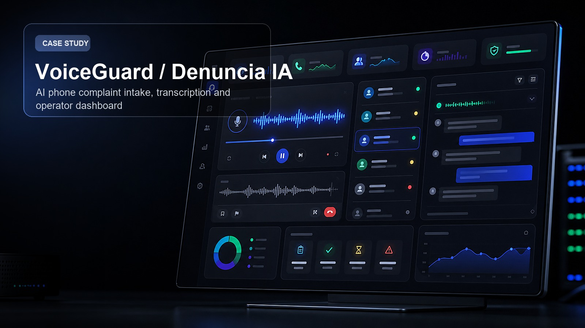
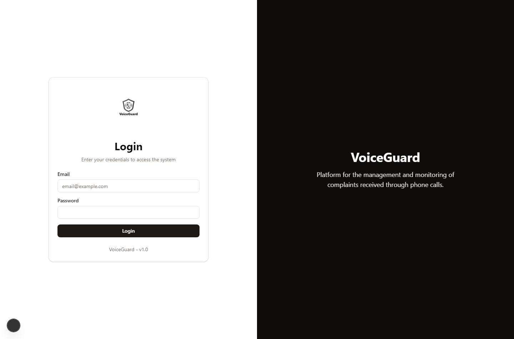

# VoiceGuard / Denuncia IA

VoiceGuard is a phone complaint intake platform. It receives calls through Twilio, records and transcribes the audio with Whisper, and gives operators a web dashboard for reviewing complaints, call metadata, categories, statuses and follow-up work.



Portfolio cover generated for presentation. Runtime screenshot:



## Features

- Twilio Voice intake through HTTP webhooks.
- Automatic transcription with OpenAI Whisper.
- Admin dashboard with complaint stats, status filters, detail pages, original audio and transcript review.
- Internal management for assignment, status updates and notes.
- Supabase-backed data layer for users, calls, complaints and storage.
- Optional email/support flows through Resend or Nodemailer.

## Stack

- Next.js
- TypeScript
- Tailwind CSS
- shadcn/ui
- Twilio Voice
- Whisper / OpenAI
- Supabase
- Resend / Nodemailer

## Run locally

```bash
npm install
npm run dev
```

Create `.env.local` from the environment example and configure Supabase, Twilio, OpenAI and email variables before using the full call pipeline.

## Core flow

1. A caller submits a complaint through a Twilio phone number.
2. Twilio sends call data and audio to the app webhook.
3. The app stores call metadata and audio.
4. Whisper transcribes the recording.
5. Operators review and manage the complaint from the dashboard.

## Suggested roadmap

- Speaker diarization and timestamps in transcripts.
- Automatic complaint classification.
- CSV/PDF report exports.
- Role-based operator/admin access.
- Response templates and notification automation.
